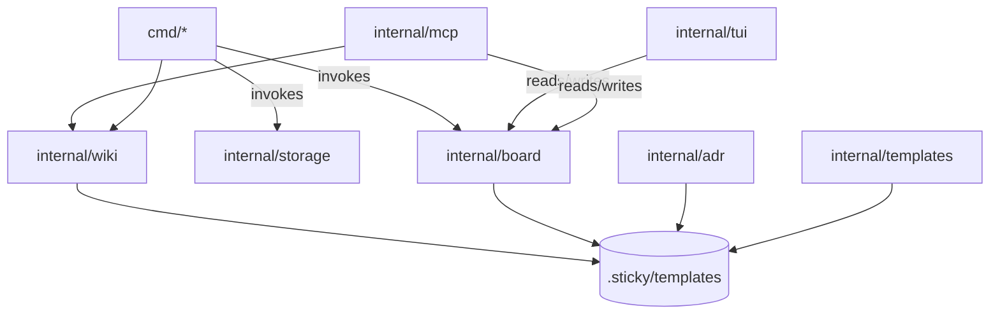
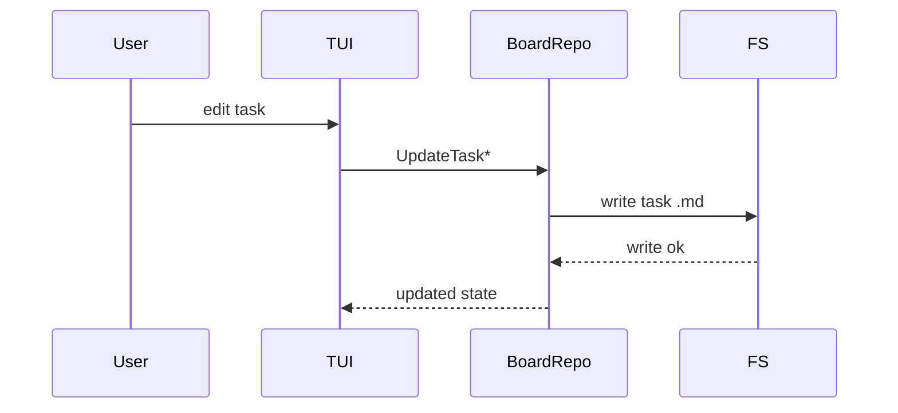
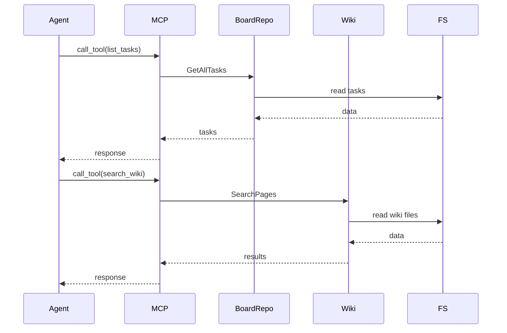
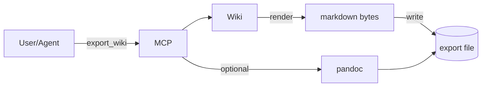

# Architecture Diagrams

This document contains Mermaid diagrams for quick, shared understanding of the mochi-sticky architecture.

## System Context

```mermaid
flowchart LR
  User[User (CLI/TUI)] -->|commands| App[m🍡ochi-sticky]
  Agent[Agent (MCP client)] -->|JSON-RPC| App
  App -->|reads/writes| FS[(.sticky/ filesystem)]
  App -->|exports| Artifacts[(markdown/pdf exports)]
```

## Components (Internal Packages)



## Task Write Flow



## MCP Read/Write Flow



## Export Flow


